```mermaid
  graph TD
    A[Code React Native] --> B[iOS natif]
    A --> C[Android natif]
    A --> D[Application Web]
    B --> E[Performance native]
    C --> E
    D --> F[Développement rapide]
    E --> G[Expérience utilisateur optimale]
    F --> G
```
  

    

    

  

  
  <h1 class="text-6xl font-bold mb-6 animate-float">
    
      ✨ Entrons dans Le Paradis des Développeurs
    
  </h1>
  
  

    🪄
    La Vraie Magie de React Native Commence
    💫
  

---
layout: iframe-left
url: https://docs.expo.dev/more/create-expo/
---

<SectionTitle position="right" title="IV - Le Paradis des Développeurs"/>

        

            

                
                
                
            

            
Terminal

        

        

            

                $
                npx create-expo-app@latest --example
            

            

                Need to install the following packages:  
                create-expo-app@latest  
                Ok to proceed? (y)
            

            

                

                    ? 
                     3" class="prompt-blue">✅ 
                    Choose an example: › 
                

                

                    - Use arrow-keys. Return to submit.
                    with-camera
                    _
                

            

            

                with-canary-react-19
                with-custom-font
                 ❯ with-camera
                with-dev-client
                with-drawer-navigation
                 with-facebook-auth
                with-firebase-saml-login
                with-formdata-image-upload
                ↓ with-formik
            

            

                

                    ? 
                    What is your app named? › my-app 
                

            

            

                

                    ? 
                    What is your app named? ... Kamera 
                

            

            

                

                    ✔ 
                     Downloaded and extracted example files.
                    
                

            

            

                    
                                npm warn deprecated inflight@1.0.6: This module is not supported, and leaks memory.
                                Do
                                not use it. Check out lru-cache if you want a good and tested way to coalesce async
                                requests by a key value, which is much more comprehensive and powerful.  
                                npm warn deprecated glob@7.2.3: Glob versions prior to v9 are no longer supported
                                 
                                npm warn deprecated glob@7.2.3: Glob versions prior to v9 are no longer supported
                                 
                    
            

            

                

                    
                              added 887 packages, and audited 888 packages in 9m  
                              72 packages are looking for funding  
                              run npm fund for details  
                              found 0 vulnerabilities  
                              ✅ Your project is ready!  
                              To run your project, navigate to the directory and run one of the following npm commands.  
                              - cd kamera   
                              - npm run android   
                              - npm run ios   
                              - npm run web   
                    
                

            

        

    

---
layout: iframe-left
url: https://t4stack.com/
---

<SectionTitle position="right" title="IV - Le Paradis des Développeurs"/>

      

          

              
              
              
          

          
Terminal

      

      

          

              $
              bun create t4-app@latest
          

          

              T4 APP
          

          

              
                  "Build Universal React (Native) Apps with Ease"  
                  ft. Tamagui + TypeScript + tRPC + Tauri  
              
                  Now with Bun! 🐰  
                  Enter the name of the project: 
          

          

          > playlist  
          👉 Setting up a new t4 project.  
          This script follows the steps below to create your project:  
          1. Clone the t4-app repository into the specified folder.  
          2. Remove git history  
          3. Install dependencies  
          4. Generate Drizzle client  
          

          

            ✔ Cloning t4-app into playlist  
            ✅ Repository cloned successfully.  
              
            Removed: playlist/.git  
            All paths removed successfully!  
            
            ✅ Git history removed.  
            ⠴ Installing dependencies  
            ✅ Dependencies installed.  
            ✅ Drizzle client generated.    
      

           💭 Remember to set up your environment variables properly:  
1. Duplicate the .env.example file, rename it to .env.local, and enter your variables.  
2. Configure Cloudflare Wrangler configs inside /apps/next/wrangler.toml and /packages/api/wrangler.toml to match your deployment environment.
  

🚀 Successfully created t4 project!  
Make sure you have a Supabase account and have created a new project. 
After filling out your .env file, run 'bun migrate:local' to create your database tables. 
To start the API and web development servers, run 'bun api' and 'bun web' in separate terminal tabs. 
      

      

---
layout: two-cols
---

<SectionTitle title="IV - Le Paradis des Développeurs"/>

  <h1 class="text-5xl font-bold mb-4 bg-gradient-to-r from-purple-600 to-pink-500 bg-clip-text text-transparent">
    Le Moment Magique 🪄
  </h1>
  
Un code unique, des possibilités infinies

  

    <pre class="text-white font-mono">$ npx expo start</pre>
  

  
  

    <h3 class="text-2xl font-bold mb-4 text-indigo-900">Une Révélation 🤯</h3>
    

      "Au début, j'étais sceptique. Encore une WebView ? Pas du tout ! C'est une vraie application native qui peut aussi être compilée pour le web !"
    

  

::right::

---
layout: image-left
image: /files/expo-go.png
---

<SectionTitle position="right" title="IV - Le Paradis des Développeurs"/>

  

    

      

        
        
        
      

      
Terminal

    

    

      

        $
        npm install -g eas-cli
      

      

        $
        eas login
      

      

        ✔ Log in successful
      

      

        $
        npx expo start
      

    

     

    
Scan with Expo Go

    

    

    

      exp://192.168.1.5:8081
    

  

  

---
layout: two-cols
---

<SectionTitle title="IV - Le Paradis des Développeurs"/>

  

    <h2 class="text-3xl font-bold mb-4">CNG 🔥</h2>
    
Génération Native Continue

    
Quand vous avez besoin des fonctionnalités mobiles spécifiques, les choses deviennent sérieuses !

  

   

    <pre class="text-white font-mono">$ npx expo run:android</pre>
    <pre class="text-white font-mono">$ npx expo run:ios</pre>
  

::right::

  

        <h3 class="text-lg font-semibold mb-3 text-gray-800">Prérequis & Configuration</h3>
        <h4 class="text-sm font-medium mb-2">Outils Nécessaires</h4>
        <ul class="space-y-2">
          <li class="flex items-center gap-2">
            

              
            

            XCode - iOS - XCode sans fi
          </li>
          <li class="flex items-center gap-2">
            

            
            

            Android Studio - Android - Débogage sans fil
          </li>
        </ul>
      

  

    
  

