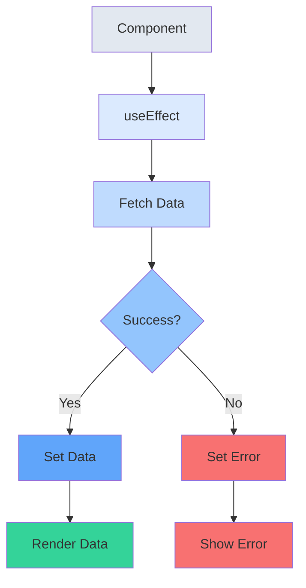
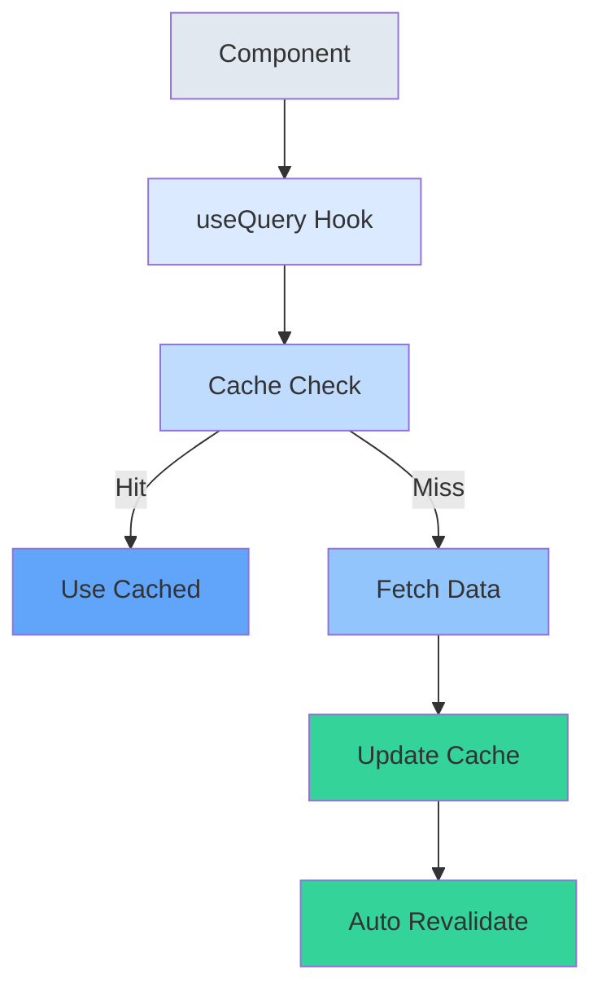

# Database & ORM <span class="text-gray-500 text-lg font-normal">Type-safe Database Access</span>

<div class="mt-8 space-y-2">

## Prisma 

> Next-generation Node.js and TypeScript ORM

### Features
- ✓ Type-safe database queries
- ✓ Auto-generated migrations
- ✓ Powerful data modeling
- ✓ Works with SQLite, PostgreSQL, MySQL
</div>

::right::
```tsx
// Define your model
model User {
  id      Int      @id @default(autoincrement())
  email   String   @unique
  name    String?
  posts   Post[]
}

// Use in your app
const user = await prisma.user.create({
  data: {
    email: 'user@example.com',
    name: 'John Doe'
  }
})
```


<style>
.space-y-12 > * + * {
  margin-top: 3rem;
}

h2 {
  font-size: 1.5rem;
  font-weight: 600;
  color: #1e293b;
  display: flex;
  align-items: center;
}

h3 {
  font-size: 1.1rem;
  font-weight: 500;
  color: #475569;
}

blockquote {
  border-left: 4px solid #3b82f6;
  padding-left: 1rem;
  color: #64748b;
  margin: 1rem 0;
}
</style>

---
layout: iframe-right
url: https://orm.drizzle.team/docs/get-started
---


## Drizzle 

> TypeScript ORM that's lightweight and edge-ready

### Features
- ✓ No runtime overhead
- ✓ SQL-like query builder
- ✓ Edge compatible
- ✓ Works with serverless

```tsx
// Define your schema
const users = sqliteTable('users', {
  id: integer('id').primaryKey(),
  email: text('email').notNull(),
  name: text('name')
})

// Use in your app
const newUser = await db.insert(users).values({
  email: 'user@example.com',
  name: 'John Doe'
}).returning()
```


<style>
.space-y-12 > * + * {
  margin-top: 3rem;
}

h2 {
  font-size: 1.5rem;
  font-weight: 600;
  color: #1e293b;
  display: flex;
  align-items: center;
}

h3 {
  font-size: 1.1rem;
  font-weight: 500;
  color: #475569;
}

blockquote {
  border-left: 4px solid #3b82f6;
  padding-left: 1rem;
  color: #64748b;
  margin: 1rem 0;
}
</style>


---
layout: two-cols
---

# Backend Solutions

### Traditional Backend
> Build your own API server with your preferred technology

```tsx

const useWeather = () => {
  return useQuery({
    queryKey: ['weather'],
    queryFn: async () => {
      const response = await fetch('https://api.weather.com/v1/current')
      if (!response.ok) {
        throw new Error('Network response was not ok')
      }
      return response.json()
    }
  })
}

const WeatherWithQuery = () => {
  const { data, isLoading, error } = useWeather()

  if (isLoading) return <div>Loading...</div>
  if (error) return <div>Error: {error.message}</div>
  return <div>Temperature: {data.temperature}°C</div>
}
```
::right::

```tsx
// Example with Express
// Traditional approach
const getWeatherData = async () => {
  try {
    const response = await fetch('https://api.weather.com/v1/current')
    if (!response.ok) {
      throw new Error('Network response was not ok')
    }
    const data = await response.json()
    return data
  } catch (error) {
    console.error('Error fetching weather:', error)
    throw error
  }
}

// Usage with error handling, loading states, etc.
const WeatherComponent = () => {
  const [data, setData] = useState(null)
  const [loading, setLoading] = useState(true)
  const [error, setError] = useState(null)

  useEffect(() => {
    const fetchData = async () => {
      try {
        const result = await getWeatherData()
        setData(result)
      } catch (err) {
        setError(err)
      } finally {
        setLoading(false)
      }
    }
    fetchData()
  }, [])

  if (loading) return <div>Loading...</div>
  if (error) return <div>Error: {error.message}</div>
  return <div>Temperature: {data?.temperature}°C</div>
}

```

---
layout: two-cols
---

# API Data Flow
## Traditional vs Modern Approach

<div class="mt-4">



</div>

::right::

<div class="mt-4">



</div>

<style>
h1 {
  font-size: 2rem;
  font-weight: 700;
  color: #1e293b;
}

h2 {
  font-size: 1.25rem;
  font-weight: 500;
  color: #64748b;
  margin-bottom: 1rem;
}

.mt-4 {
  margin-top: 1rem;
}
</style>

---

### GraphQL
> Single endpoint, request exactly what you need

```tsx
const GET_USER = gql`
  query GetUser($id: ID!) {
    user(id: $id) {
      name
      email
      posts {
        title
      }
    }
  }
`
```

---
layout: two-cols
---


# Backend as a Service (BaaS)

#### Supabase 
- ✓ PostgreSQL Database
- ✓ Real-time subscriptions
- ✓ Auth & Storage
- ✓ Edge Functions

<br>

#### Firebase 
- ✓ Real-time Database
- ✓ Cloud Functions
- ✓ Authentication
- ✓ Analytics
::right::

#### Realm 
- ✓ Local-first database
- ✓ Offline-first sync
- ✓ Real-time updates
- ✓ Cross-platform


<style>

h2 {
  color: #64748b;
  font-size: 1.5rem;
  font-weight: 500;
  margin-bottom: 2rem;
}

h3, h4 {
  color: #1e293b;
  font-size: 1.25rem;
  font-weight: 600;
  margin-bottom: 1rem;
}

blockquote {
  border-left: 4px solid #00bf60;
  padding-left: 1rem;
  color: #475569;
  margin: 1.5rem 0;
}

.space-y-6 > * + * {
  margin-top: 1.5rem;
}
</style>
