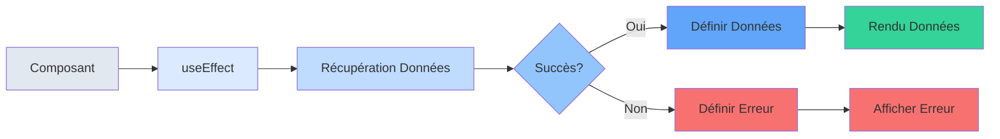
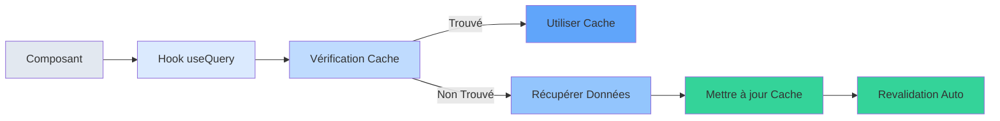
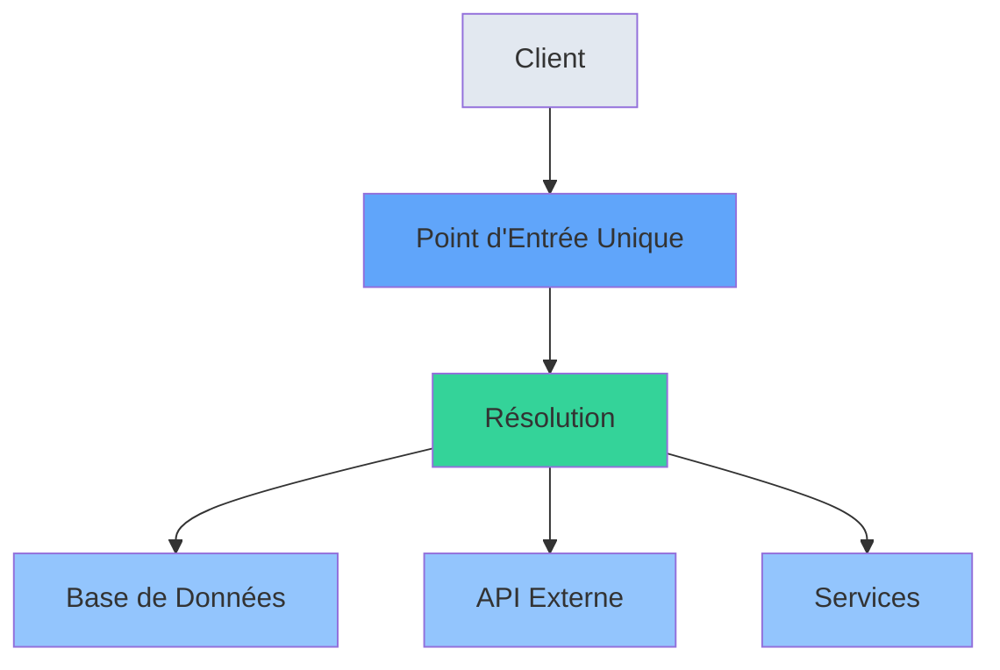

# Database & ORM <span class="text-gray-500 text-lg font-normal">Type-safe Database Access</span>

<div class="mt-8 space-y-2">

## [Prisma](https://prisma.io/orm) 

> ORM Node.js et TypeScript de nouvelle génération

<br/>

### Fonctionnalités

- ✓ Requêtes de base de données type-safe
- ✓ Migrations auto-générées
- ✓ Modélisation puissante des données
- ✓ Compatible avec SQLite, PostgreSQL, MySQL
</div>

::right::

```tsx
// Define your model
model User {
  id      Int      @id @default(autoincrement())
  email   String   @unique
  name    String?
  posts   Post[]
}

// Use in your app
const user = await prisma.user.create({
  data: {
    email: 'user@example.com',
    name: 'John Doe'
  }
})
```

<style>
.space-y-12 > * + * {
  margin-top: 3rem;
}

h2 {
  font-size: 1.5rem;
  font-weight: 600;
  color: #1e293b;
  display: flex;
  align-items: center;
}

h3 {
  font-size: 1.1rem;
  font-weight: 500;
  color: #475569;
}

blockquote {
  border-left: 4px solid #3b82f6;
  padding-left: 1rem;
  color: #64748b;
  margin: 1rem 0;
}
</style>

---
layout: iframe-right
url: https://orm.drizzle.team/docs/get-started
---

## [Drizzle](https://orm.drizzle.team/) 

> ORM TypeScript léger et prêt pour l'edge

### Fonctionnalités

- ✓ Pas de surcharge à l'exécution
- ✓ Constructeur de requêtes style SQL
- ✓ Compatible edge
- ✓ Fonctionne avec le serverless

```tsx
// Define your schema
const users = sqliteTable("users", {
  id: integer("id").primaryKey(),
  email: text("email").notNull(),
  name: text("name"),
});

// Use in your app
const newUser = await db
  .insert(users)
  .values({
    email: "user@example.com",
    name: "John Doe",
  })
  .returning();
```

<style>
.space-y-12 > * + * {
  margin-top: 3rem;
}

h2 {
  font-size: 1.5rem;
  font-weight: 600;
  color: #1e293b;
  display: flex;
  align-items: center;
}

h3 {
  font-size: 1.1rem;
  font-weight: 500;
  color: #475569;
}

blockquote {
  border-left: 4px solid #3b82f6;
  padding-left: 1rem;
  color: #64748b;
  margin: 1rem 0;
}
</style>

---

# Approche Traditionnelle de la Gestion des Données

## Défis

- Gestion manuelle des états de chargement
- Pas de mise en cache intégrée
- Risque de requêtes en cascade
- Code verbeux et répétitif

<div class="mt-8">



</div>

---

# Approche Moderne avec TanStack Query

## Avantages

- Mise en cache automatique intelligente
- Revalidation en arrière-plan
- Dédoublonnage des requêtes
- Gestion optimiste des mises à jour
- Synchronisation en temps réel
- Pagination infinie intégrée



---
layout: two-cols
---

# GraphQL

<div class="mt-4">



</div>

::right::

> Un point d'entrée unique, demandez exactement ce dont vous avez besoin

### Avantages

- ✓ Requêtes précises et flexibles
- ✓ Pas de sur-récupération de données
- ✓ Documentation auto-générée
- ✓ Type-safety intégré

```tsx
const GET_USER = gql`
  query GetUser($id: ID!) {
    user(id: $id) {
      name
      email
      posts {
        title
        comments {
          content
          author
        }
      }
    }
  }
`;
```

---
layout: two-cols
---

# Backend as a Service (BaaS)

#### [Supabase](https://supabase.com/docs) 

- ✓ PostgreSQL Database
- ✓ Real-time subscriptions
- ✓ Auth & Storage
- ✓ Edge Functions

<br>

#### [Firebase](https://firebase.google.com/docs) 

- ✓ Real-time Database
- ✓ Cloud Functions
- ✓ Authentication
- ✓ Analytics

::right::

#### [Realm](https://www.mongodb.com/docs/realm/) 

- ✓ Local-first database
- ✓ Offline-first sync
- ✓ Real-time updates
- ✓ Cross-platform

<br>

#### [PocketBase](https://pocketbase.io/docs/) 

- ✓ Backend sans dépendance
- ✓ Backend ultra léger (16MB)
- ✓ Interface d'administration intégrée
- ✓ Stockage de fichiers & authentification
- ✓ Souscriptions temps réel

<style>

h2 {
  color: #64748b;
  font-size: 1.5rem;
  font-weight: 500;
  margin-bottom: 2rem;
}

h3, h4 {
  color: #1e293b;
  font-size: 1.25rem;
  font-weight: 600;
  margin-bottom: 1rem;
}

blockquote {
  border-left: 4px solid #00bf60;
  padding-left: 1rem;
  color: #475569;
  margin: 1.5rem 0;
}

.space-y-6 > * + * {
  margin-top: 1.5rem;
}
</style>
