---
layout: image
image: /slides/2.jpg
transition: slide-left
---

---
layout: image-right
image: /images/Mianala.jpg
transition: slide-left
---

# Randriamanasina Mianala Loharano

#### Ingénieur Logiciel | Fondateur de [_Stage_](stage.loha.dev) et [_Loha.dev_](loha.dev)

 

> Plus de 10 ans d'expérience en développement logiciel

 

### 🎓 Formation & Certifications

 

- Master en Informatique
- Certificat d'Anglais des Affaires
- Certification DevOps

---

# Mon Parcours

  
Débuts E-commerce

  
  

    

       

        <a href="http://zahividy.mg" class="text-red-600 hover:text-red-800" target="_blank">
          zahividy.mg (2015)
        </a>
      

      
Focus uniquement sur la technologie, sans vision business

    

  

  

    
Leçon Apprise

    

      La technologie n'est qu'une composante du succès - le produit nécessite une vision globale
    

  

---

# Projets Gouvernementaux

  
Ministère des Finances

  
  

    
Développement de systèmes critiques

    <a href="https://www.dgbf.mg/transparence" class="text-blue-500 hover:underline">
      dgbf.mg/transparence
    </a>
  

  

    

      
      
Portail de Transparence

    

    

      
      
Système de Messagerie

    

  

---
layout: two-cols
---

# Succès en Freelance

  
60.000$+

  
  

    
Revenus sur trois ans

    
Expérience avec des SAAS internationaux

  

::right::
  

    
  

---
layout: two-cols
---

## Leadership

# Direction Technique

  
CTO chez Olona

  
  

    
3 mois d'expérience en tant que Directeur Technique

    
Expertise approfondie des opérations backend

    
Identification des services essentiels pour l'industrie

  

::right::

  

    
  

---

# Formation & Mentorat

  
Partage d'Expérience

  
  

    

      100.000 - 500.000 Ar
      par classe
    

    

      Une valeur de formation de 500.000 Ar offerte à 1/10 du prix grâce à mon investissement dans ce programme
    

  

  

    
Services Proposés

    

      

        👨‍🏫
        Formation Individuelle
      

      

        🤝
        Mentorat de Développeurs
      

      

        💡
        Accompagnement Personnalisé
      

    

  

---
layout: iframe-right
url: https://stage.loha.dev
---

# Focus Actuel : Stage

### Une Plateforme pour les Artistes

 

- Application Web (NextJS)
- Application Mobile (React Native)
- **Disponible** sur App Store & Play Store
- Plan gratuit pour tous

### Progression du Développement

---
layout: center
class: text-center
---

  

    🔥
  

  

    Aujourd'hui, je vais partager avec vous tout ce qu'il faut savoir sur
  

  

    le Développement 
    d'Applications Mobiles
  

  

    
      Apprenez tout sur la création d'applications mobiles avec React Native
    
  

  

---
class: p-0
---

  

    

      
Que va-t-on apprendre ?

      

        <a href="/11" class="text-blue-600 hover:text-blue-800 font-medium">Développeurs</a>
        <a href="/12" class="text-slate-600 hover:text-emerald-800 font-medium" :class="{ 'border-b-2 border-emerald-600': $slidev.nav.currentPage === 9 }">Étudiants</a>
        <a href="/13" class="text-slate-600 hover:text-purple-800 font-medium" >Entrepreneurs</a>
      

    

  

  

    <h1 id="developers" class="text-4xl font-bold mb-12">Pour les Développeurs</h1>
     
    

      

        Construisez des solutions pratiques avec de nouveaux outils pour votre boîte à outils
      

       
      

        🛠️ Nouveaux Outils
        ⚡ Compétences Pratiques
        🎯 Solutions Réelles
      

    

  

---
class: p-0
---

  

    

      
Que va-t-on apprendre ?

      

        <a href="/11" class="text-slate-600 hover:text-blue-800 font-medium">Développeurs</a>
        <a href="/12" class="text-emerald-600 hover:text-emerald-800 font-medium">Étudiants</a>
        <a href="/13" class="text-slate-600 hover:text-purple-800 font-medium" >Entrepreneurs</a>
      

    

  

  

    <h1 id="students" class="text-4xl font-bold mb-12">Pour les Étudiants</h1>
     
    

      

        Apprenez les compétences essentielles à travers le développement mobile pratique
      

       
      

        📚 Formation
        📱 Dév Mobile
        🎓 Apprentissage Guidé
      

    

  

---
class: p-0
---

  

    

      
Que va-t-on apprendre ?

      

        <a href="/11" class="text-slate-600 hover:text-blue-800 font-medium">Développeurs</a>
        <a href="/12" class="text-slate-600 hover:text-emerald-600 font-medium" >Étudiants</a>
     <a href="/13" class=" text-purple-600 hover:text-emerald-800 font-medium">Entrepreneurs</a>
      

    

  

  

    <h1 id="entrepreneurs" class="text-4xl font-bold mb-12">Pour les Entrepreneurs</h1>
     
    

      

        Obtenez la visibilité nécessaire pour prendre des décisions éclairées
      

       
      

        💡 Vision Produit
        📊 Compréhension du Marché
        🚀 Croissance Stratégique
      

       
      

        "Plus vous en savez, plus vous pouvez aider, plus vous pouvez créer de la valeur"
      

    

  

---
class: p-0
---

  

      <h2 class="text-xl font-bold">Le   programme</h2>
      

          

              ⏰
              

              

          

          <h2 class="text-xl text-center font-bold mt-4">1. Pourquoi maintenant ?</h2>
          

              +
          

      

  

  <!-- Pipeline Card -->
  

      

          🛣️
          

          

      

      <h2 class="text-xl text-center font-bold mt-4">2. Pipeline</h2>
      

          +
      

  

  

      

          🗄️
          

          

      

      <h2 class="text-xl text-center font-bold mt-4">3. Prérequis</h2>
      

          +
      

  

  <!-- Developer's Paradise Card -->
  

      

          🛠️
          

          

      

      <h2 class="text-xl text-center font-bold mt-4">4. Paradis des Développeurs</h2>
      

          +
      

  

  <!-- Publishing Card -->
  

      

          🚀
          

          

      

      <h2 class="text-xl text-center font-bold mt-4">5. Publication</h2>
      

          +
      

  

<!-- Monetization Card -->

  

      💰
      

      

  

  <h2 class="text-xl text-center font-bold mt-4">7. Monétisation</h2>
  

      +
  

<!-- Q&A Session Card -->

  

      💭
      

      

  

  <h2 class="text-xl text-center font-bold mt-4">8. Session Q&R</h2>
  

      +
  

---
layout: center
class: text-center
---

  

    
      🎯
    
    Prêt ?
  

  

    

      C'EST PARTI
    

    

  

  

    Espace
    pour continuer
  

---
layout: cover
background: /slides/now.png
---

  

    I. Pourquoi maintenant ?
  

  

    Je pense que la plupart d'entre vous 
    le savent déjà.
    Et c'est pour cela que vous êtes là.
  

  

    Découvrons pourquoi c'est le moment idéal →
  

---
layout: two-cols
---

<SectionHeader />

# Analyse du Temps d'Écran

  
4h 48 mn

  
Utilisation Mobile Quotidienne

  
4h 6mn

  
Utilisation PC Quotidienne

  
  

    *Varie selon les pays, ratio moyen de 57%/43%
    <a href="https://www.demandsage.com/screen-time-statistics/" class="text-blue-500 hover:underline ml-1" target="_blank">
      →
    </a>
  

### Points Clés

- Le mobile domine le temps d'écran
- Usage mobile en hausse de 6.5% par an
- 92% du temps sur les applications
- Les réseaux sociaux en tête

 

> Source: DataReportal Digital 2024

::right::

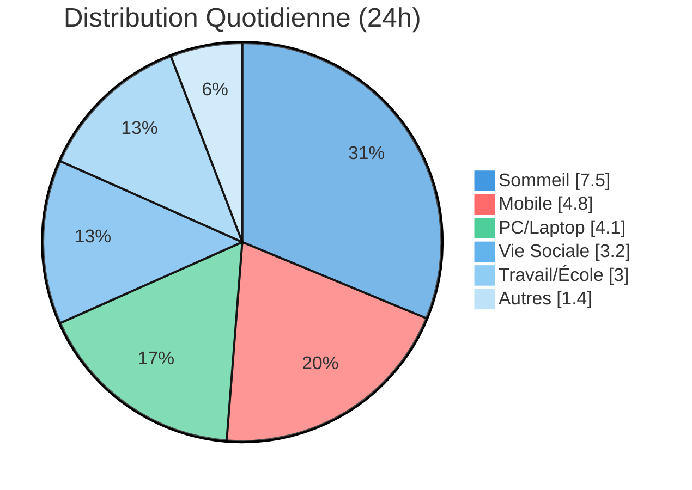
```mermaid {theme: 'neutral', scale: 0.8}
pie showData title Distribution Quotidienne (24h)
    "Sommeil" : 7.5
    "Mobile" : 4.8
    "PC/Laptop" : 4.1
    "Vie Sociale" : 3.2
    "Travail/École" : 3.0
    "Autres" : 1.4

%%{init: {
  'theme': 'base',
  'themeVariables': {
    'pie1': '#4299E1',
    'pie2': '#FF6B6B',
    'pie3': '#4ECE98',
    'pie4': '#63B3ED',
    'pie5': '#90CDF4',
    'pie6': '#BEE3F8'
  }
}}%%
```

  <a href="https://datareportal.com/reports/digital-2024-global-overview-report" class="text-blue-500 hover:text-blue-700">
    Source →
  </a>

---
layout: two-cols
---

<SectionHeader />

# Adoption des Appareils Mobiles

85.95% (~8 Milliards)

Adoption Mondiale des Smartphones

  Source: <a href="https://www.demandsage.com/smartphone-usage-statistics/" class="text-blue-500 hover:underline" target="_blank">
    demandsage.com/smartphone-usage-statistics →
  </a>

44.90% (13.79 Millions)

Utilisateurs de Smartphones à Madagascar ("1/2024")

  Source: <a href="https://datareportal.com/reports/digital-2024-madagascar" class="text-blue-500 hover:underline" target="_blank">
    datareportal.com/reports/digital-2024-madagascar →
  </a>

### Analyse du Marché

- Les zones urbaines mènent l'adoption
- Croissance rurale en accélération
- Appareils abordables en hausse
- Internet principalement mobile

::right::

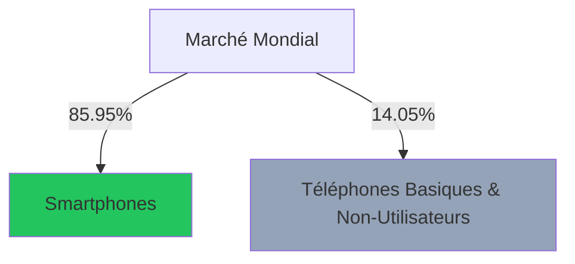
```mermaid {theme: 'neutral', scale: 0.8}
graph TD
    World["Marché Mondial"]

    World -->|"85.95%"| WorldSmartphone["Smartphones"]
    World -->|"14.05%"| WorldOther["Téléphones Basiques & Non-Utilisateurs"]

style WorldSmartphone fill:#22C55E
style WorldOther fill:#94A3B8
```

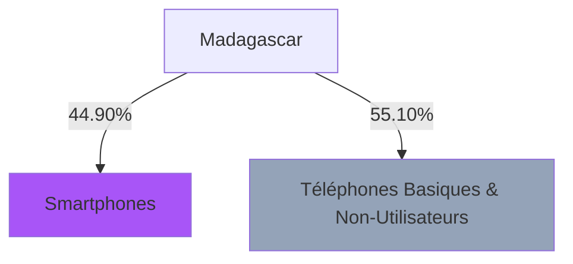
```mermaid {theme: 'neutral', scale: 0.8}
graph TD
    Madagascar["Madagascar"]

    Madagascar -->|"44.90%"| MadSmartphone["Smartphones"]
    Madagascar -->|"55.10%"| MadOther["Téléphones Basiques & Non-Utilisateurs"]

style MadSmartphone fill:#A855F7
style MadOther fill:#94A3B8
```

---
layout: two-cols
---

<SectionHeader />

# Aperçu du Marché

935 Mrd$

Revenus Mobile (2023)

593 Mrd$

Logiciels Traditionnels

### Tendances du Marché

- Dominance du mobile-first
- Croissance mobile plus rapide
- Taux d'engagement supérieur
- Barrières d'entrée réduites

 

::right::

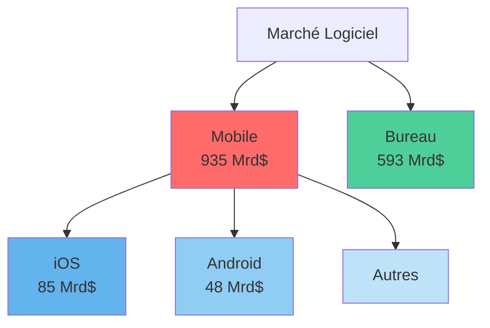
```mermaid {theme: 'neutral', scale: 0.8}
graph TD
    Market["Marché Logiciel"]
    Mobile["Mobile<br/>935 Mrd$"]
    Traditional["Bureau<br/>593 Mrd$"]

    Market --> Mobile
    Market --> Traditional

    Mobile --> AppStore["iOS<br/>85 Mrd$"]
    Mobile --> PlayStore["Android<br/>48 Mrd$"]
    Mobile --> Other["Autres"]

style Mobile fill:#FF6B6B
style Traditional fill:#4ECE98
style AppStore fill:#63B3ED
style PlayStore fill:#90CDF4
style Other fill:#BEE3F8
```

  

    Sources: 
    <a href="https://www.statista.com/forecasts/1262892/mobile-app-revenue-worldwide-by-segment" class="text-blue-500 hover:underline" target="_blank">
      statista.com/forecasts/mobile-app-revenue →
    </a>
  

  

    <a href="https://ryvilion.medium.com/statistics-on-mobile-app-downloads-and-usage-2023-04c919d9a139" class="text-blue-500 hover:underline" target="_blank">
      medium.com/statistics-on-mobile-app-downloads →
    </a>
  

  

    <a href="https://www.atimi.com/posts/mobile-apps-are-expected-to-generate-935-billion-in-revenue-by-2023" class="text-blue-500 hover:underline" target="_blank">
      .atimi.com/mobile-apps-are-expected-to-generate-935-billion-in-revenue-by-2023 →
    </a>
  

---
layout: two-cols
---

<SectionHeader />

  

    "Soyez là où sont vos utilisateurs - sur mobile"
  

  

    

      📱 Mobile en Premier
      🎯 Accès Direct
      💫 Meilleure Expérience
    

 
    

      Vos utilisateurs sont déjà sur leurs téléphones. C'est là que votre application doit être - accessible, pratique et prête à l'emploi.
    

  

::right::

  

    
    

  

  

    
    

  

---
layout: two-cols
---

<SectionHeader />

# Mon Parcours Mobile

  

  

    

    

      
      
Hira Fiderana

      
Kotlin & Jetpack Compose

    

  

  

    

    

      
      
The Playlist

      
Flutter

    

  

  

    

    

      
      
Android Natif

      
Java

    

  

::right::

  

  

    

    

      
      
Solutions Hybrides

      
Cordova, PhoneGap & Ionic

    

  

---
layout: center
class: p-0
---

<SectionHeader />

  

  

    
    
Flutter

  

  

    
VS

    

      Comme Naruto & Sasuke
    

  

  

    
    
React Native

  

  

    S'améliorant mutuellement vers l'excellence 🚀
  

---
layout: center
---

<SectionHeader />

  Pourquoi React Native, Pourquoi Maintenant ?

 Il n'a jamais été aussi facile de créer des applications mobiles prêtes pour la production

  🔒 SÉCURISÉ

  🛩️ STABLE

  ✅ RELIABLE

---
layout: two-cols
---

<SectionHeader />

# Développement Mobile :   Avant vs Maintenant

  

    
🎯

    

      
Base de Code Unique

      
Écrire une fois, déployer partout

    

  

  

    
⚡

    

      
Performance Native

      
Composants natifs réels, pas de WebView

    

  

  

    
🔄

    

      
Rechargement en Direct

      
Retour instantané des modifications

    

  

  

    
✨

    

      
UI Simplifiée

      
Développement d'interface facilité

    

  

::right::

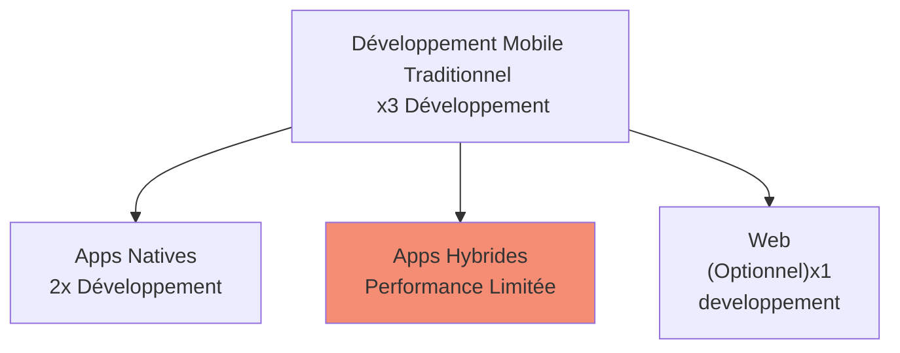
```mermaid {theme: 'neutral', scale: 0.8}
graph TD
    Start["Développement Mobile Traditionnel <br/> x3 Développement"] --> Native["Apps Natives<br/>2x Développement"]
    Start --> Hybrid["Apps Hybrides<br/>Performance Limitée"]
    Start --> Web["Web <br/>(Optionnel)x1  <br/> developpement"]
style Hybrid fill:#f58d75
```

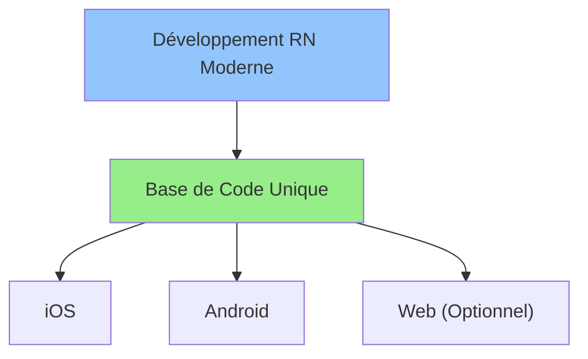
```mermaid {theme: 'neutral', scale: 0.8}
graph TD
    Modern["Développement RN Moderne"] --> Single["Base de Code Unique"]
    Single --> iOS["iOS"]
    Single --> Android["Android"]
    Single --> Web["Web (Optionnel)"]

style Modern fill:#93c5fd
style Single fill:#96ED89
```

---
layout: center
---

<SectionHeader />

# Communauté & Écosystème

  

    <a href="https://npmtrends.com/react-native" target="_blank" class="hover:opacity-80 transition-opacity">
      
2M+ 📉

      
Téléchargements npm mensuels

    </a>
  

  

    <a href="https://github.com/facebook/react-native" target="_blank" class="hover:opacity-80 transition-opacity">
      
121K+ ⭐️

      
Étoiles GitHub

    </a>
  

  

    <a href="https://github.com/jondot/awesome-react-native" target="_blank" class="hover:opacity-80 transition-opacity">
      
34.9K+ ⭐️

      
awesome-react-native

    </a>
  

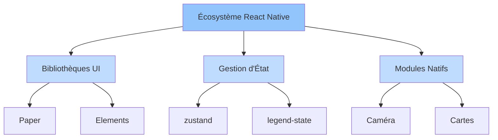
```mermaid {theme: 'neutral', scale: 0.8}
graph TD
    RN["Écosystème React Native"]

    RN --> UI["Bibliothèques UI"]
    RN --> State["Gestion d'État"]
    RN --> Native["Modules Natifs"]

    UI --> Paper["Paper"]
    UI --> Elements["Elements"]

    State --> zustand["zustand"]
    State --> legend-state["legend-state"]

    Native --> Camera["Caméra"]
    Native --> Maps["Cartes"]

style RN fill:#93c5fd
style UI fill:#bfdbfe
style State fill:#bfdbfe
style Native fill:#bfdbfe
```

---
layout: two-cols
---

<SectionHeader />

# Cross-Platform & Coûts

  

    
Logique Cross-Platform

    <ul class="space-y-2 text-gray-600">
      <li>Logique métier partagée (auth, API, état)</li>
      <li>Adaptations minimales par plateforme</li>
      <li>Code réutilisable à 90%</li>
    </ul>
  

  

    
Réduction des Coûts

    <ul class="space-y-2 text-gray-600">
      <li>Une seule équipe pour les deux plateformes</li>
      <li>Mise sur le marché plus rapide</li>
      <li>Maintenance simplifiée</li>
    </ul>
  

::right::

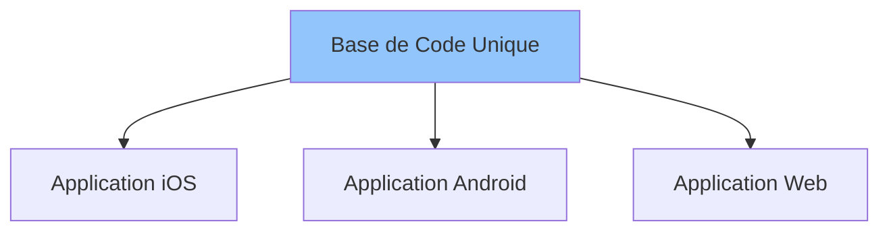
```mermaid {theme: 'neutral', scale: 0.8}
graph TD
    Code["Base de Code Unique"]
    Code --> iOS["Application iOS"]
    Code --> Android["Application Android"]
    Code --> Web["Application Web"]

style Code fill:#93c5fd
```

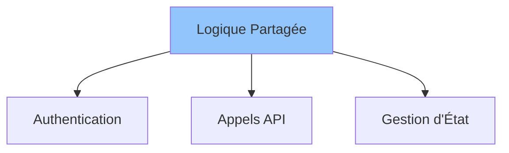
```mermaid {theme: 'neutral', scale: 0.8}
graph TD
    Logic["Logique Partagée"]
    Logic --> Auth["Authentication"]
    Logic --> API["Appels API"]
    Logic --> State["Gestion d'État"]

style Logic fill:#93c5fd
```

---
layout: center
---

<SectionHeader />

# Courbe d'Apprentissage

  

    

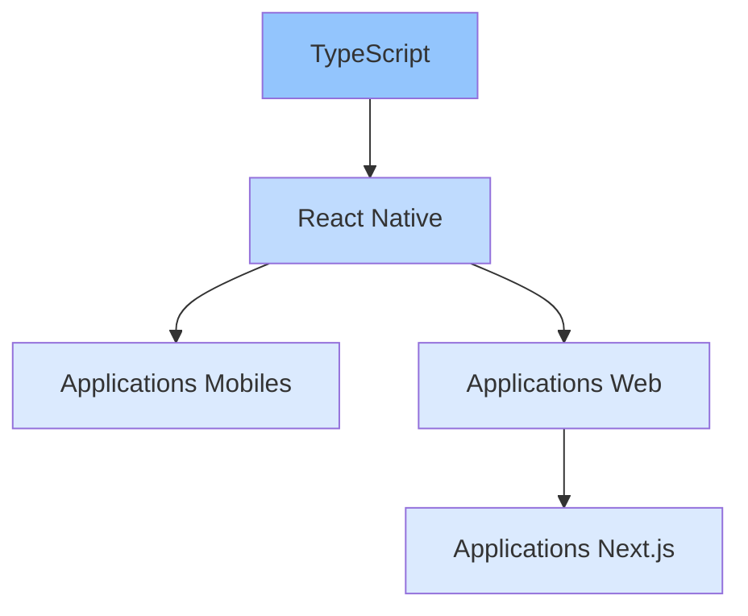
```mermaid {theme: 'neutral', scale: 0.8}
graph TD
    TS["TypeScript"] --> RN["React Native"]
    RN --> Mobile["Applications Mobiles"]
    RN --> Web["Applications Web"]
    Web --> Next["Applications Next.js"]

    style TS fill:#93c5fd
    style RN fill:#bfdbfe
    style Mobile fill:#dbeafe
    style Web fill:#dbeafe
    style Next fill:#dbeafe
```

      Un langage pour les gouverner tous : TypeScript
    

  

  

   

    

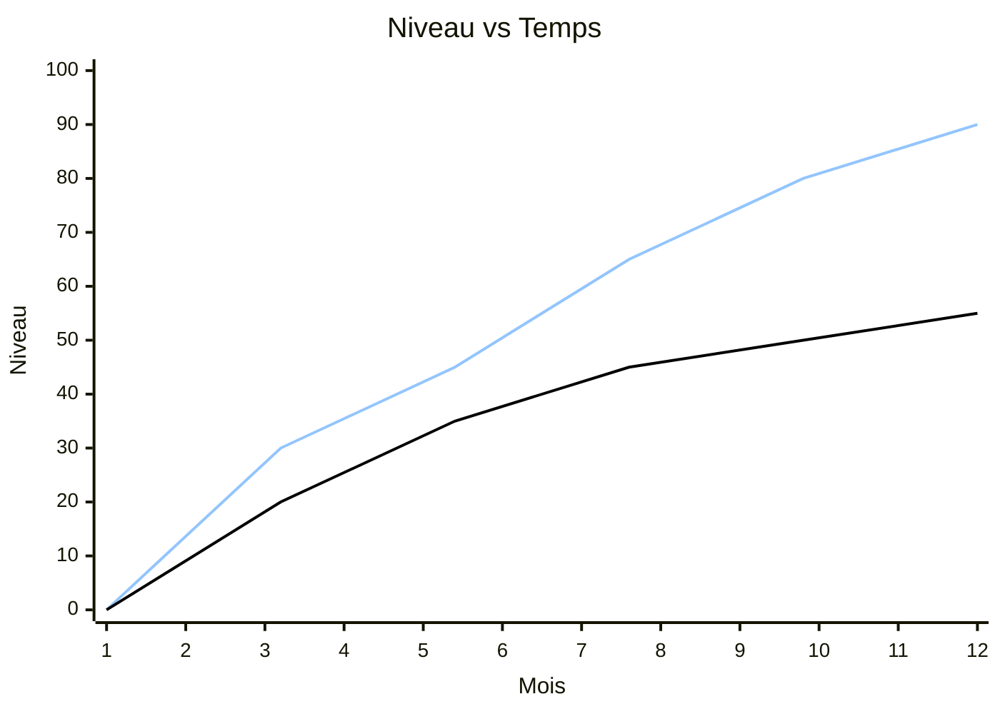
```mermaid 
%%{init: {'theme': 'neutral', "themeVariables": {"xyChart": {"plotColorPalette":" #93c5fd, #000"} } }}%%
xychart-beta
title "Niveau vs Temps"
x-axis "Mois" 1 --> 12
y-axis "Niveau" 0 --> 100
line "React Native" [0, 30, 45, 65, 80, 90]
line "Natif Android/iOS" [0, 20, 35, 45, 50, 55]
```

      Autres Solutions vs Typescript React
    

  
  

  

---
layout: center
class: p-0
---

<SectionHeader />

<SlidevVideo autoplay controls>
  <source src="/files/bacon.mp4" type="video/mp4" />
  

    Your browser does not support videos. You may download it
    <a href="/myMovie.mp4">here</a>.
  

</SlidevVideo>

---
layout: center
class: text-center
---

<SectionHeader />

  

    <mdi-trending-up class="text-green-600 text-3xl" />
    Valeur 
    des applications mobiles en forte hausse
  

  

    <mdi-trending-down class="text-blue-600 text-3xl" />
    Difficulté 
    de développement considérablement réduite
  

  <mdi-lightbulb class="text-yellow-500" />
  "De mon point de vue, c'est clairement la meilleure technologie pour créer des applications mobiles"

 

    La Révolution du Développement Mobile 🎉
  

---
src: ./pages/2-pipeline.md
---

---
src: ./pages/3-prerequisite.md
---

---
src: ./pages/4-code.md
---

---
src: ./pages/42-terminal.md
---

---
src: ./pages/43-ui-component.md
---

---
src: ./pages/44-backend.md
---

---
src: ./pages/45-text.md
---

---
src: ./pages/5-publish.md
---

---
src: ./pages/6-monetization.md
---

---
src: ./pages/7-tips.md
---

---
src: ./pages/8-conclusion.md
---
