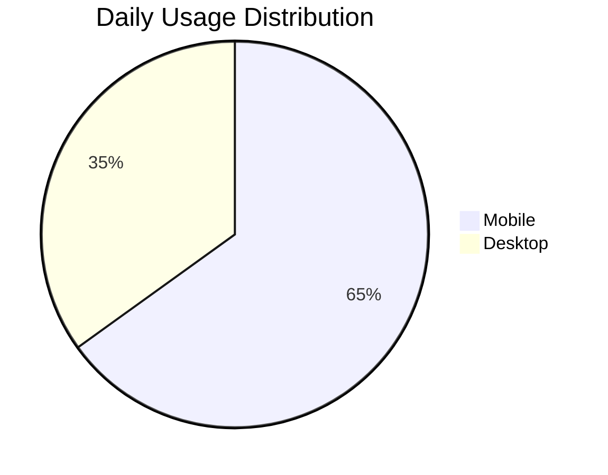
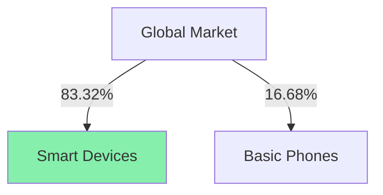
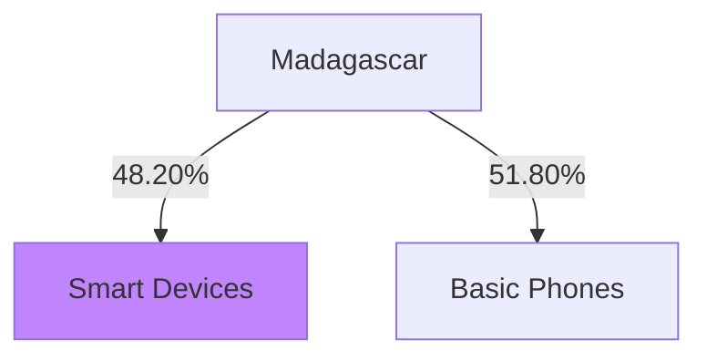
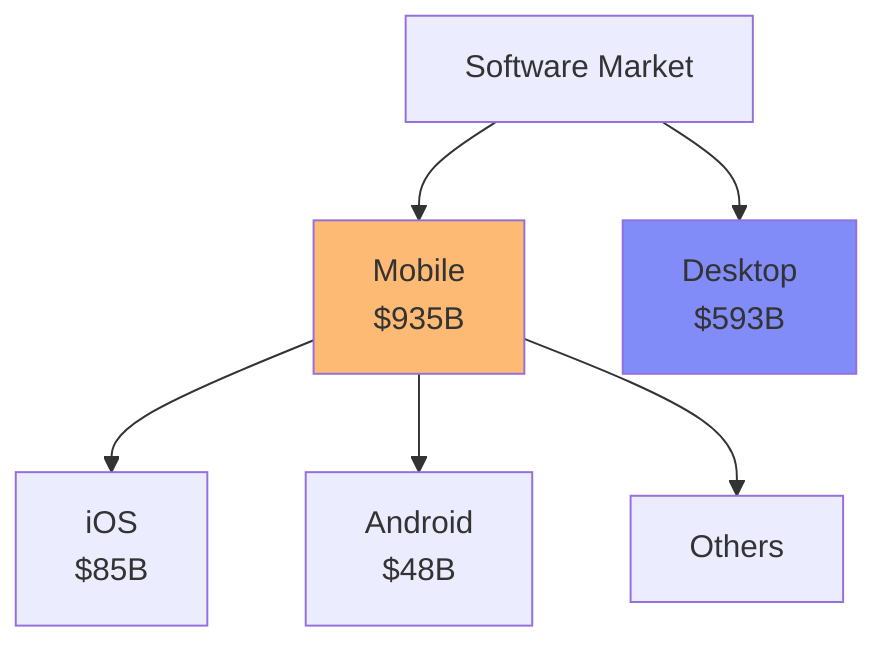
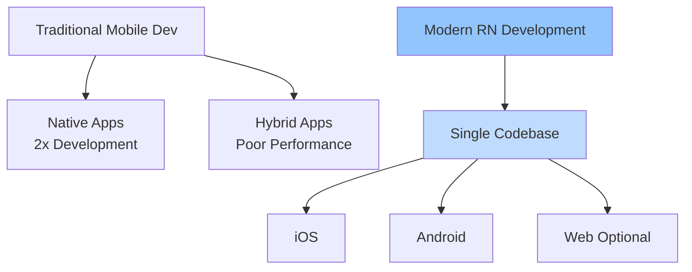
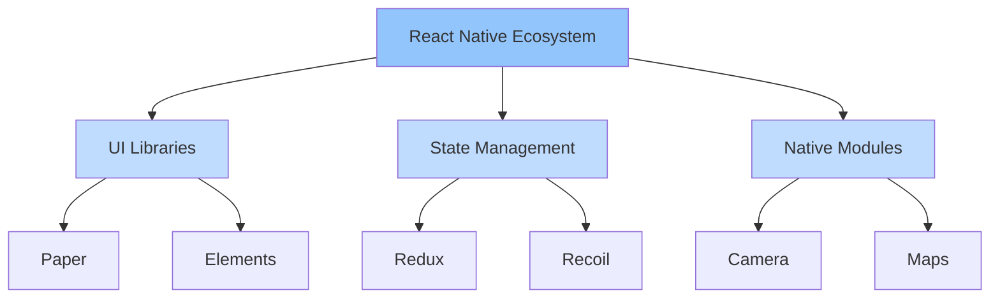
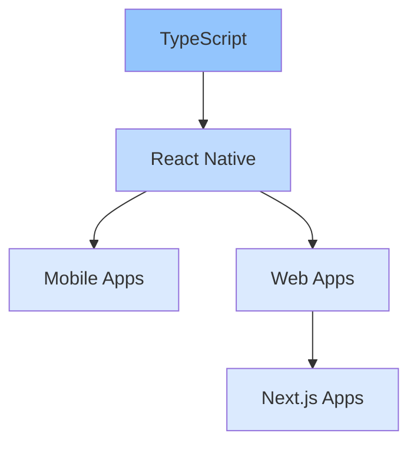

---
layout: image
image: /slides/2.jpg
---

---
layout: image-right
image: /images/Mianala-Family.jpg
---

# Randriamanasina Mianala Loharano
#### Software Enngineer | Founder of [*Stage*](stage.loha.dev) and [*Loha.dev*](loha.dev)
 

> 10+ years of experience in Software Development

 

### 🚀 Expertise
 

- Full-Stack Development 
- Mobile App Development
- Marketing
- Technical and Practical Leadership
- Software Architecture
- DevOps & CI/CD

---
layout: image-right
image: /images/Mianala.jpg
---

# Randriamanasina Mianala Loharano
#### Software Enngineer | Founder of [*Stage*](stage.loha.dev) and [*Loha.dev*](loha.dev)
 

> 10+ years of experience in Software Development

 

### 🎓 Education & Certifications

 

- Master's in Computer Science
- English - Business Certificate 
- DevOps Certification

---
layout: two-cols
---

# My Journey

 

### Early Days
-  [zahividy.mg](http://zahividy.mg) (2015)  
  *All tech, no business skills*

 

### Government Projects
- Built  critical systems  for Ministry of Finance
- [dgbf.mg/transparence](https://www.dgbf.mg/transparence)

 

### Freelancing Success
-  **$60,000+**  revenue over 3 years
- International SAAS projects

::right::
### Leadership

-  Chief Technical Officer  at Olona
- Backend operations expertise
- Team management

 

### Education
-  Teaching 100k-500k Ar class
- Mentoring new developers

---
layout: iframe-right
url: https://stage.loha.dev
---

# Current Focus: Stage

### A Platform for Performers

 

- Web App (NextJS)
- Mobile App (React Native)
- **Available now** on App Store & Play Store
- Free plan for everyone

### Development Progress

---
layout: center
class: text-center
---

  

    🔥
  

  

    Today, I'll share everything you need to know about
  

  

    Mobile App 
    Development
  

  

    
      Learn all about mobile app creation with React Native
    
  

  

---

  

    

      
What will you learn?

      

        <a href="#developers" class="text-blue-600 hover:text-blue-800 font-medium" :class="{ 'border-b-2 border-blue-600': $slidev.nav.currentPage === 8 }">Developers</a>
        <a href="#students" class="text-slate-600 hover:text-emerald-800 font-medium" :class="{ 'border-b-2 border-emerald-600': $slidev.nav.currentPage === 9 }">Students</a>
        <a href="#entrepreneurs" class="text-slate-600 hover:text-purple-800 font-medium" :class="{ 'border-b-2 border-purple-600': $slidev.nav.currentPage === 10 }">Entrepreneurs</a>
      

    

  

  

    <h1 id="developers" class="text-4xl font-bold mb-12">For Developers</h1>
     
    

      

        Build practical solutions with new tools for your toolkit
      

       
      

        🛠️ New Tools
        ⚡ Practical Skills
        🯠Real Solutions
      

    

  

---

  

    

      
What will you learn?

      

        <a href="#developers" class="text-slate-600 hover:text-blue-800 font-medium" :class="{ 'border-b-2 border-blue-600': $slidev.nav.currentPage === 8 }">Developers</a>
        <a href="#students" class="text-emerald-600 hover:text-emerald-800 font-medium" :class="{ 'border-b-2 border-emerald-600': $slidev.nav.currentPage === 9 }">Students</a>
        <a href="#entrepreneurs" class="text-slate-600 hover:text-purple-800 font-medium" :class="{ 'border-b-2 border-purple-600': $slidev.nav.currentPage === 10 }">Entrepreneurs</a>
      

    

  

  

    <h1 id="students" class="text-4xl font-bold mb-12">For Students</h1>
     
    

      

        Learn the essential skills through hands-on mobile development
      

       
      

        📚 Bootcamp
        📱 Mobile Dev
        📠Guided Learning
      

    

  

---

  

    

      
What will you learn?

      

        <a href="#developers" class="text-slate-600 hover:text-blue-800 font-medium" :class="{ 'border-b-2 border-blue-600': $slidev.nav.currentPage === 8 }">Developers</a>
        <a href="#students" class="text-slate-600 hover:text-emerald-800 font-medium" :class="{ 'border-b-2 border-emerald-600': $slidev.nav.currentPage === 9 }">Entrepreneurs</a>
        <a href="#entrepreneurs" class="text-purple-600 hover:text-purple-800 font-medium" :class="{ 'border-b-2 border-purple-600': $slidev.nav.currentPage === 10 }">Students</a>
      

    

  

  

    <h1 id="entrepreneurs" class="text-4xl font-bold mb-12">For Entrepreneurs</h1>
       
    

      

        Gain the visibility you need to make informed decisions
      

       
      

        💡 Product Vision
        📊 Market Understanding
        🚀 Strategic Growth
      

       
      

        "The more you know, the more you can help, the more value you can create"
      

    

  

---
layout: center
fonts:
  sans: Robot
  weights: '200,400,600'
  italic: false
---

  

    <h2 class="text-xl font-bold">The   plan</h2>
    

      

        ⏰
        

      

      <h2 class="text-xl text-center font-bold mt-4">Why now?</h2>
      

+
      

    

  

    

      📝
      

    

    <h2 class="text-xl text-center font-bold mt-4">Prerequisites</h2>
    

+
      

  

  

    

      🔄
      

    

    <h2 class="text-xl text-center font-bold mt-4">Pipeline</h2>
    

+
      

  

  

    

      🛠️
      

    

    <h2 class="text-xl text-center font-bold mt-4">Developer's Paradise</h2>
    

+
      

  

  

    

      🚀
      

    

    <h2 class="text-xl text-center font-bold mt-4">Publishing</h2>
    

+
      

  

  

    

      💰
      

    

    <h2 class="text-xl text-center font-bold mt-4">Monetization</h2>
    

+
      

  

  

    

      💭
      

    

    <h2 class="text-xl text-center font-bold mt-4">Q&A Session</h2>
    

+
      

  

---
layout: center
class: text-center
---

  

    Ready?
  

  

    

      GO
    

    

  

  

    Press Space to continue
  

---
layout: cover
background: /slides/bg-1-why-now.jpg
---

  

    I. Why now?
  

  

    I believe that most of you already know this.
    And that's why you came.
  

  

    Let's explore why this is the perfect moment
  

---
layout: two-cols
---

# Screen Time Analysis

5.4h

Daily Mobile Usage

2.9h

Daily Desktop Usage

Source: DataReportal Digital 2023

### Key Insights
- Mobile dominates screen time
- 65% more mobile vs desktop usage
- Consistent YoY growth
- Social media as main driver

::right::

  <a href="https://datareportal.com/reports/digital-2023-global-overview-report" class="text-blue-500 hover:text-blue-700">
    Source →
  </a>

---
layout: two-cols
---

# Global Device Usage

83.32%

Global Smartphone Adoption

48.20%

Madagascar Smartphone Users

Source: BankMyCell 2023

### Market Analysis
- Urban areas lead adoption
- Rural growth accelerating
- Affordable devices driving change
- Mobile-first internet access

::right::

---
layout: two-cols
---

# Market Overview

$935B

Mobile Revenue (2023)

$593B

Traditional Software

Source: Statista Market Outlook

### Industry Trends
- Mobile-first dominance
- Faster mobile growth
- Higher engagement rates
- Lower entry barriers

::right::

---
layout: two-cols
---

  

    "Meet users where they are - on mobile"
  

  

    

      📱 Mobile First
      🯠Direct Access
      💫 Better Experience
    

 
    

      Your users are already on their phones. That's where your app needs to be - accessible, convenient, and ready to use.
    

  

::right::

  

    
    

  

  

    
    

  

---
layout: two-cols
---

# My Mobile Journey

  

  

    

    

      
      
Hira Fiderana

      
Kotlin & Jetpack Compose

    

  

  

    

    

      
      
The Playlist

      
Flutter

    

  

  

    

    

      
      
Native Android

      
Java & Kotlin

    

  

::right::

  

  

    

    

      
      
Webview wrappers

      
Cordova & Phone Gap & Ionic

    

  

---
layout: center
---

  

    
    
Flutter

  

  

    
vs

    
Like Naruto & Sasuke

  

  

    
    
React Native

  

  Pushing each other to get better 🚀

---
layout: center
class: text-center
---

# The Evolution of Mobile Development

  

    
👶

    
Early Days

    

      Webview Wrappers
       
      Cordova, Phonegap, Ionic
    

  

  

    
🏃‍♂️

    
Growing Phase

    

      Cross-Platform Solutions
       
      Flutter, React Native
    

  

  

    
🚀

    
Today

    

      Mature Ecosystem
       
      Production-Ready Tools
    

  

---
layout: cover
class: text-center
---

  Why React Native, Why Now?

  🎯 SAFE

  🛡️ STABLE

  ⚡ RELIABLE

  It's never been easier to build production-ready mobile apps

---
layout: two-cols
---

# Building Mobile Apps:   Then vs Now

  

    
🎯

    

      
Single Codebase

      
Write once, run everywhere

    

  

  

    
⚡

    

      
Native Performance

      
Real native components, not WebView

    

  

  

    
🔄

    

      
Live Reloading

      
Instant feedback loop

    

  

::right::

---
layout: two-cols
---

# Community & Ecosystem

  

    
2M+

    
Monthly npm Downloads

  

  

    
50K+

    
GitHub Stars

  

  

    
Backed by Industry Giants

    
Meta, Microsoft, Shopify, Discord

  

::right::

---
layout: center
---

  

    Learning Curve Comparison
  

  

  

    One language to rule them all: TypeScript
  

---
layout: center
class: text-center
---

  The Mobile Development Revolution

  

    ↗️ Value 
    of mobile apps increased drastically
  

  

    ↘️ Difficulty 
    in building decreased significantly
  

  "From what I see, this is hands down the best tech to build mobile apps with"

---
src: ./pages/2-pipeline.md
---

---
src: ./pages/3-prerequisite.md
---

---
src: ./pages/4-code.md
---

---
src: ./pages/42-terminal.md
---

---
src: ./pages/43-ui-component.md
---

---
src: ./pages/44-backend.md
---

---
src: ./pages/45-text.md
---

---
src: ./pages/5-publish.md
---

---
src: ./pages/6-monetization.md
---

---
src: ./pages/7-tips.md
---

---
src: ./pages/8-conclusion.md
---